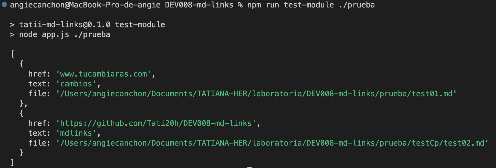
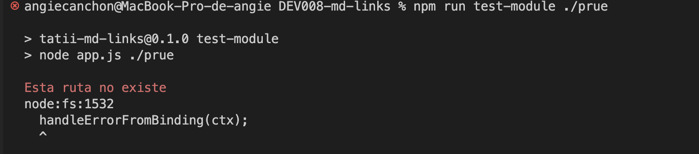
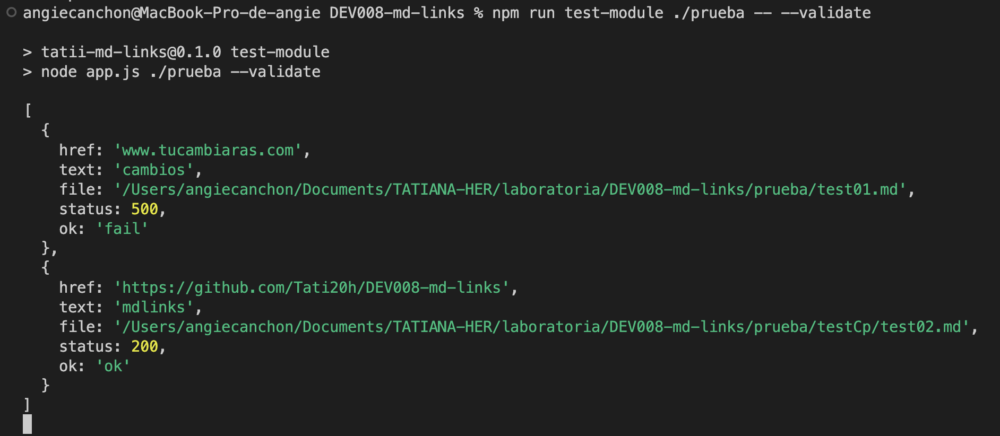
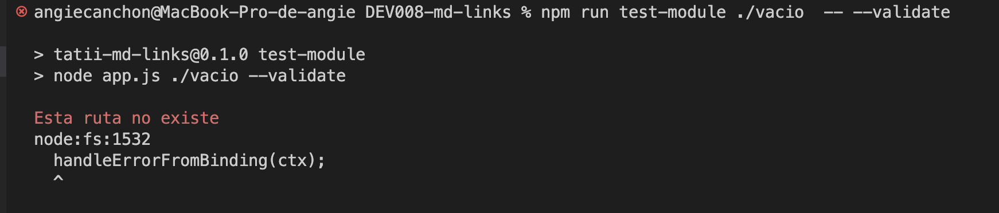
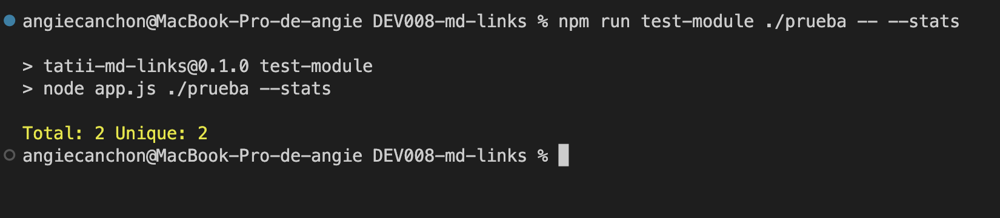
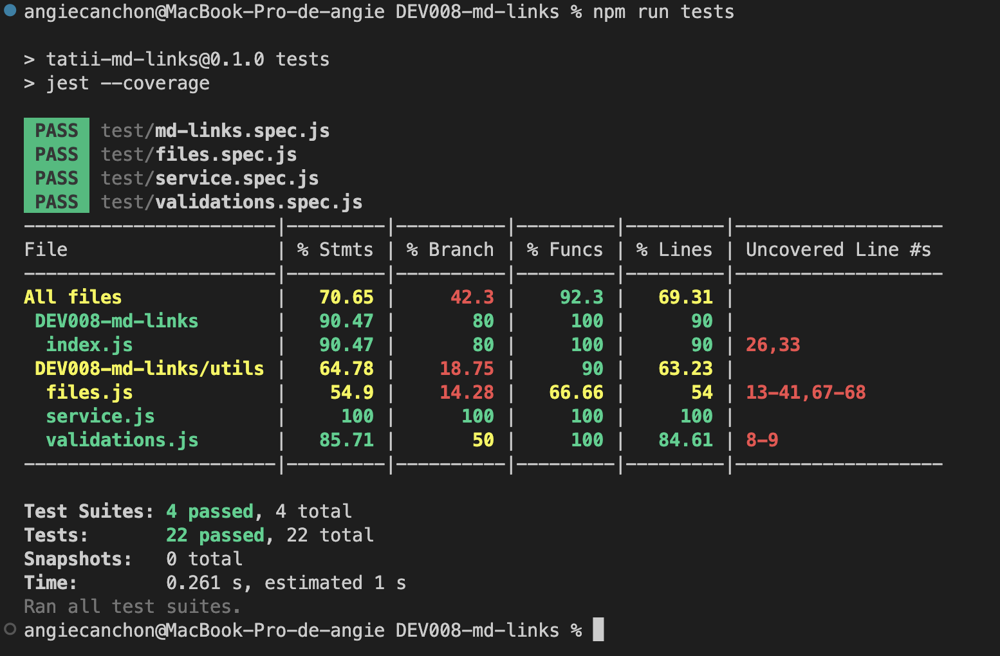

    <a 
      href="https://www.npmjs.com/package/tatii-md-links"> 📚 tatii-md-links </a>

 

  <a href="https://github.com/Tati20h/DEV008-md-links"> Tati20h/DEV008-md-links </a>

  

# Markdown Links
## Índice
* [1. Preámbulo](#1-Introducción)
* [2. Resumen del proyecto](#2-Resumen-del-proyecto)
* [3. Pasos para ejectutar la libreria (CLI/API)](#3-Como-ejectutar-la-libreria-(CLI/API))
* [4. Pruebas unitarias JEST](#4-Pruebas-unitarias-JEST)
* [5. Metodo planificación y Scrum](#5-Metodo-planificación-y-Scrum)
* [6. Checklist - Requisitos](#6-Checklist--Requisitos)

***

## 1. Introducción

[Markdown](https://es.wikipedia.org/wiki/Markdown) es un lenguaje de marcado ligero muy popular entre developers; ampliamente utilizado en plataformas de blogging, sitios web documentación y otros contextos en línea, ya que permite a los usuarios crear contenido con un formato coherente sin la necesidad de conocimientos profundos de estos . Además, muchas herramientas y plataformas admiten Markdown, lo que facilita su integración en diversos flujos de trabajo.
La sintaxis de Markdown es muy simple y utiliza caracteres especiales para indicar diferentes elementos de formato.

Estos archivos `Markdown` normalmente contienen _links_ (vínculos/ligas) que
muchas veces están rotos o y no son válidos, por lo que se ha crea esta
herramienta usando [Node.js](https://nodejs.org/), la cual analizara los
archivos encontradados para verificar los links y crear reportes de estadisticas.

## 2. Proyecto Markdown Links
Este proyecto es una herramienta o aplicación diseñada para analizar y gestionar los enlaces dentro de documentos escritos en formato Markdown.
El propósito principal de este proyecto sería permitir a los usuarios identificar de manera eficiente los enlaces presentes en sus archivos Markdown y verificar su validez. ejecuta por medio  una línea de comando (CLI).

La funcionalidad clave de este proyecto podría incluir:

### Análisis de Enlaces:
La herramienta sería capaz de escanear documentos Markdown en busca de enlaces, ya sean enlaces a otras páginas web, recursos en línea o incluso referencias internas dentro del mismo documento.

### Validación de Enlaces:
 Una vez identificados los enlaces, la herramienta verificaría la vigencia de cada enlace, asegurando que los enlaces a sitios web estén activos y accesibles.

### Generación de Reportes:
El proyecto podría generar informes detallados que muestren una lista de enlaces encontrados junto con su estado de validez. Esto permitiría a los usuarios identificar y corregir enlaces rotos o desactualizados en sus documentos Markdown.

## 1. Pasos para ejectutar la libreria (CLI/API). 💻
CLI (aplicación de línea de comandos)

### Instalación.⬇️
Dentro de tu terminal ejecuta el siguiente comando:

  `npm i tatii-md-links`

#### Inicar la libreria.📚
Luego de instalar la libreria , sera necesario proporcionar los datos en la terminal de la siguiente forma:

`npm run test-module <path> <options>`

- Path (Url o Ruta relativa u absoluta).

- Options a ejecutar (--validate, --stats, --validate --stats, solo la path).

- En caso de se una ruta no encontrada o la ruta no fue proporcionada correctamente lanzara `error`.

### Ingresos de opciones y resultados esperados.

 ### 1. `npm run test-module <path>`
Al ejecutar esta opción donde solo se proporciona la ruta la libreria solo enlistara los links encontrados.

✅

En caso de no encontrar ruta o no ser proporcionada conrrectamente lanzara error u ruta no encontrada.

❌

### 2. `npm run test-module <path> -- --validate`
Al ejecutar esta opción el modulo hara una petición HTTP mostrando si los links encontrados funcionan o no.
Si el link resulta en una redirección a una URL que responde ok, entonces consideraremos el link como funcional.

📚✅

Si el link resulta en una redirección a una URL que responde fail, entonces consideraremos el link como roto.
Si no encuentra ningun archivo se lanzara `error`.

❌

### 3. `npm run test-module <path> -- --stats`
Al ejecutar esta opción el output (salida) será un texto con estadísticas básicas sobre los links, donde se mostrara
la cantidad de links encontrados y no repetidos.
Si no encuentra ningun archivo se lanzara `error`.

📊

### 4. `npm run test-module <path> -- --validate --stats`
Al ejecutar esta opción el output (salida) será un texto con estadísticas básicas sobre los links, donde se mostrara
la cantidad de links encontrados y no repetidos, ademas de analizar la cantidad de links rotos u no funcionales.
Si no encuentra ningun archivo se lanzara `error`.

## 2. Para ejecutar como API :
API (Interfaz de Programación de Aplicaciones).

### Instalacion.

Para iniciar comó una API:

1. Realice clone de repositorio repositorio de GitHub.
2. En la terminal ejecute el comando cd para ir a la carpeta donde desea guardar el proyecto.
3. Ejecute el siguiente comando:
`git clone git@github.com:Tati20h/DEV008-md-links.git`
4. Abrir la carpeta donde se guardo la libreria.

Finalizados los pasos puede comenzar a ejecutar la libreria en su terminal.

### Inicar la libreria.
Cuando se tenga la libreria instalada sera necesario proporcionar los datos en la terminal de la siguiente forma:

`npm run test-module <path> [options]`

- Path (Url o Ruta relativa u absoluta).

- Options a ejecutar (--validate, --stats, --validate --stats, solo la path).

- En caso de se una ruta no encontrada o la ruta no fue proporcionada correctamente lanzara `error`.

## 4. Pruebas unitarias JEST.
Resultados de pruebas realizadas a las funciones puras.

* [ :chart:] Pruebas unitarias cubren un mínimo del 70% de statements, functions,
  lines, y branches.
* [ :chart:] Pasa tests (y linters) (`npm run test`).

 

## 5. Metodo planificacion y Scrum.
El metodo para desarrollar el proyecto fue por medio de GitHub Projects, Issues y Milestones.

<a href="https://github.com/users/Tati20h/projects/1/views/1?visibleFields=%5B%22Title%22%2C%22Assignees%22%2C%22Status%22%2C%22Labels%22%2C%22Linked+pull+requests%22%2C%22Reviewers%22%2C%22Repository%22%2C%22Milestone%22%5D&layout=table">  📝GitHub Projects🧾 </a>

### Diagrama de flujo desarrollo de proyecto.

### API `mdLinks(path, opts)`

* [ :chart:] El módulo exporta una función con la interfaz (API) esperada.
* [ :chart:] Implementa soporte para archivo individual
* [ :chart:] Implementa soporte para directorios
* [ :chart:] Implementa `options.validate`

### CLI

* [ :chart:] Expone ejecutable `md-links` en el path (configurado en `package.json`)
* [ :chart:] Se ejecuta sin errores / output esperado
* [ :chart:] Implementa `--validate`
* [ :chart:] Implementa `--stats`

 

